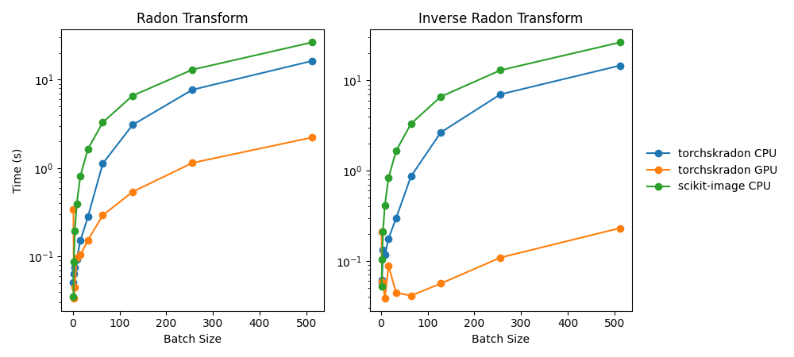

# torchskradon

(WORK IN PROGRESS) A differentiable PyTorch implementation of the forward and inverse Radon transform.

## About
`torchskradon` mimics the implementation of [`radon`](https://scikit-image.org/docs/stable/api/skimage.transform.html#skimage.transform.radon) and [`iradon`](https://scikit-image.org/docs/stable/api/skimage.transform.html#skimage.transform.iradon) from [`scikit-image`](https://scikit-image.org). All transforms work with batched multi-channel data and are fully differentiable. This allows backpropagation through `torchskradon` functions to train neural networks or solve simple optimization tasks (see [examples](#examples)).

## Basic Usage
```python
import torch
from skimage.data import shepp_logan_phantom
from skimage.transform import rescale
from functional import skradon, skiradon

device = torch.device('cuda' if torch.cuda.is_available() else 'cpu')

image = shepp_logan_phantom()
image = rescale(image, scale=0.4, mode='reflect', channel_axis=None)
image = torch.from_numpy(image).unsqueeze(0).unsqueeze(0).to(device)
theta = torch.linspace(0.0, 180.0, max(image.size()[2:])+1)[:-1].to(device)
sinogram = skradon(image, theta=theta)
reconstruction_fbp = skiradon(sinogram, theta=theta, filter_name='ramp')
```

## Examples
For more detailed examples and use cases, see the `examples/` directory:

- [`examples/basic_usage.py`](examples/basic_usage.py) - Basic forward and inverse Radon transforms
- [`examples/torchskradon_model.py`](examples/torchskradon_model.py) - Model-based image reconstruction
- [`examples/torchskiradon_model.py`](examples/torchskiradon_model.py) - Model-based sinogram reconstruction

## Accuracy
The mean squared error between the transforms in `torchskradon` and their respective [`scikit-image`](https://scikit-image.org) counterparts is typically less than 0.0001% of the maximum of scikit-image's output array.

## Performance 

## Acknowledgements
This package is inspired by implementations of the Radon transform and its' inverse in [`skimage.transform`](https://github.com/scikit-image/scikit-image/tree/main/src/skimage/transform), which are based on [1-3].

## References
1. JK Romberg, ["Image Projections and the Radon Transform"](https://www.clear.rice.edu/elec431/projects96/DSP/bpanalysis.html)

2. AC Kak, M Slaney, “Principles of Computerized Tomographic Imaging”, IEEE Press 1988.

3. B.R. Ramesh, N. Srinivasa, K. Rajgopal, “An Algorithm for Computing the Discrete Radon Transform With Some Applications”, Proceedings of the Fourth IEEE Region 10 International Conference, TENCON ‘89, 1989  